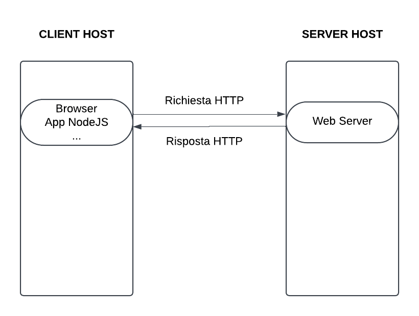

# HTTP

HTTP, acronimo di Hypertext Transfer Protocol, è il protocollo di comunicazione utilizzato per scambiare informazioni sul web. È uno dei protocolli fondamentali di Internet e definisce come i messaggi vengono formattati e trasmessi, e quali azioni i server web e i browser devono intraprendere in risposta a vari comandi.

## Richieste HTTP

Una richiesta HTTP è generata da un client (browser web, codice JavaScript, ecc.) per richiedere azioni da un server.

Le parti di una richiesta HTTP, che posono essere interpretate come i parametri di una funzione, sono:

- Metodo HTTP: Indica l'azione da eseguire sulle risorse specificate. I metodi più comuni sono:
  - GET (per recuperare risorse)
  - POST (per inviare dati al server)
  - DELETE (per eliminare risorse)
- URL: Indica la posizione della risorsa sul server a cui si desidera accedere
- Headers: forniscono informazioni aggiuntive
- Body: Opzionale e utilizzato per inviare dati al server (come i dati di un form). Può essere passato con il metodo POST.

[](http.png)

## Risposte HTTP

Una risposta HTTP è inviata dal server in risposta a una richiesta.

Le parti di una risposta HTTP sono:

- Status code: Indica se la richiesta è stata completata con successo o se si è verificato un errore. I codici di stato più comuni sono:
  - 2xx (Successo)
  - 3xx (Reindirizzamento)
  - 4xx (Errore del client)
  - 5xx (Errore del server)
- Headers: forniscono informazioni aggiuntive
- Body: Contiene i dati richiesti
  
## Esempio 1

Richiesta

- Metodo: `GET`
- URL: `https://www.pascal.edu.it`
- Headers: `{}`
- Body: `null`

Risposta

- Status code: `200 OK`
- Headers: `{ "Content-Type": "text/html; charset=UTF-8" }`
- Body:

```html
<!DOCTYPE html>
<html lang="it">

<head>
    <title>Istituto di Istruzione Superiore Blaise Pascal</title>
    <meta http-equiv="Content-Type" content="text/html; charset=UTF-8">
    <meta name="viewport" content="width=device-width, initial-scale=1, shrink-to-fit=no">
    <meta name="title" content="Istituto di Istruzione Superiore Blaise Pascal">
    <meta name="description"
        content="Sito web istituzionale Istituto di Istruzione Superiore Blaise Pascal - Via Makallè 12 - 42124 Reggio Emilia">
    <meta name="keywords" content="">
    <meta name="pvw-sede_codice" content="REII0010">

...
```

## Esempio 2

Richiesta

- Metodo: `GET`
- URL: `https://gmail.com`
- Headers: `{}`
- Body: `null`

Risposta

- Status code: `301 Moved Permanently`
- Headers:

```json
{ 
    "Location": "https://www.google.com/gmail/",
    "Content-Type": "text/html; charset=UTF-8",
    ...
}
```

- Body:

```html
<HTML>

<HEAD>
    <meta http-equiv="content-type" content="text/html;charset=utf-8">
    <TITLE>301 Moved</TITLE>
</HEAD>

<BODY>
    <H1>301 Moved</H1>
    The document has moved
    <A HREF="https://mail.google.com/mail/u/0/">here</A>.
</BODY>

</HTML>
```

## Esempio 3

Nell'esempio proposto di seguito viene mostrato come fare una richiesta GET a JSONPlaceholder per ottenere un post specifico. JSONPlaceholder è un servizio online gratuito che fornisce dati falsi JSON per test e prototipazione.

Richiesta

- Metodo: `GET`
- URL: `https://jsonplaceholder.typicode.com/posts/1`
- Headers: `{}`
- Body: `null`

Risposta

- Status code: `200 OK`
- Headers:

```json
{
    "Content-Type": "application/json",
    "Server": "cloudflare",
    "Date": "Wed, 08 Jan 2025 21:12:14 GMT"
    ...
}
```

- Body:

```json
{
    "userId": 1,
    "id": 1,
    "title": "sunt aut facere repellat provident occaecati excepturi optio reprehenderit",
    "body": "quia et suscipit\nsuscipit recusandae consequuntur expedita et cum\nreprehenderit molestiae ut ut quas totam\nnostrum rerum est autem sunt rem eveniet architecto"
}
```

## Esempio 4

Richiesta

- Metodo: `POST`
- URL: `https://api.openai.com/v1/chat/completions`
- Headers: `{ "Authorization": "Bearer <OPENAI_API_KEY>" }`
- Body:

```json
{
    "model": "gpt-4o",
    "messages": [
        {
            "role": "user",
            "content": "Inventati una storiella"
        }
    ]
}
```

Risposta

- Status code: `200 OK`
- Headers:

```json
{
    "Content-Type": "application/json",
    "openai-processing-ms": 3385,
    "Date": "Wed, 08 Jan 2025 21:12:14 GMT"
    ...
}
```

- Body:

```json
{
    "id": "chatcmpl-AnXy77iOrwwcTfUWoiBXTZSYTjoKh",
    "object": "chat.completion",
    "created": 1736372011,
    "model": "gpt-4o-2024-08-06",
    "choices": [
        {
            "index": 0,
            "message": {
                "role": "assistant",
                "content": "In un piccolo villaggio arroccato sulle colline umbre, viveva un giovane contadino di nome Luca, noto per il suo talento nel coltivare zucche gigantesche. Ogni anno, con l'avvicinarsi dell'autunno, il villaggio si riuniva per la Festa della Zucca, ...",
                "refusal": null
            },
            "logprobs": null,
            "finish_reason": "stop"
        }
    ],
    "usage": {
        "prompt_tokens": 20,
        "completion_tokens": 232,
        "total_tokens": 252,
        "prompt_tokens_details": {
            "cached_tokens": 0,
            "audio_tokens": 0
        },
        "completion_tokens_details": {
            "reasoning_tokens": 0,
            "audio_tokens": 0,
            "accepted_prediction_tokens": 0,
            "rejected_prediction_tokens": 0
        }
    },
    "system_fingerprint": "fp_b7d65f1a5b"
}
```
